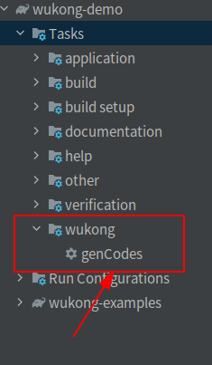
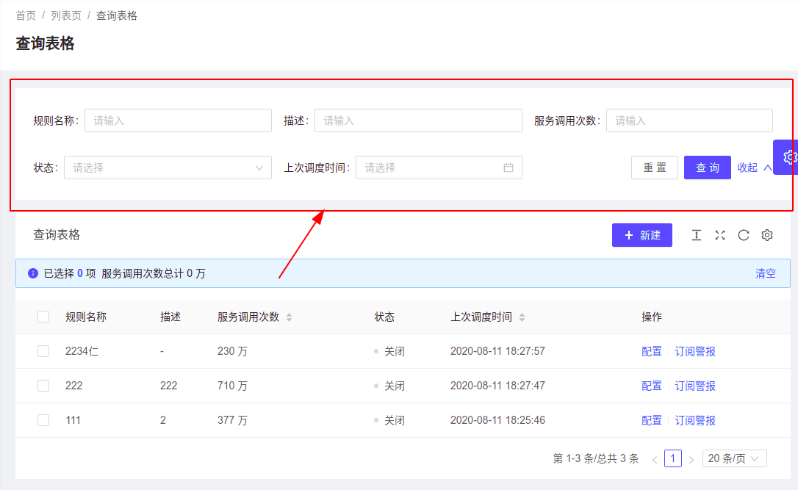
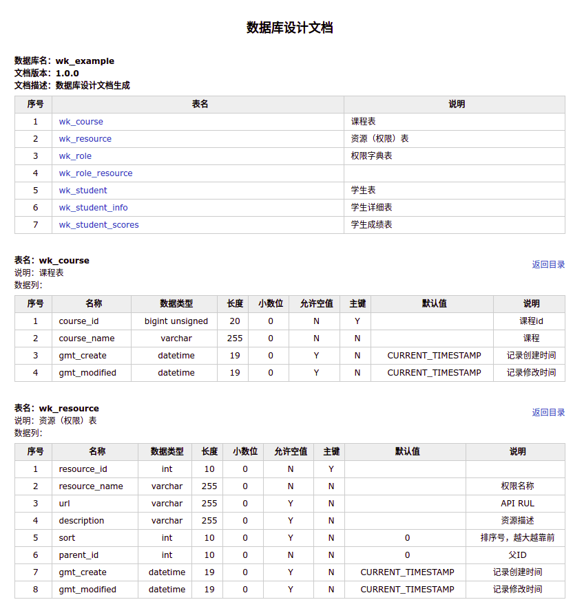

# 快速上手

 `springboot2.0` `springsecurity` `testng`  `mybatis` `jwt` `https` `redis` `gitlab` 

①②③④⑤⑥⑦⑧⑨


# 1. 搭建开发环境

建议在linux下开发，这样有种飞的感觉，如果在windows下开发，想死的心都有。


## ① 关键步骤

* 1:安装Idea
  * 需要安装 lombda插件

* 2:安装openJdk11
* 3:[安装docker与docker-compose](https://get.daocloud.io/)

* 4:[一键安装mysql redis rabbitmq](docker/readme.md)

* 5:[idea 从github上下载代码(需要注册github)](https://github.com/fanhualei/wukong-demo)
* 7:idea 刷新gradle并build整个工程	
* 8:可以打开examples项目，运行一下看看。


## ② Build作用

在build example时候，会进行以下工作：

* 自动建立数据库
  * 会使用flyway，自动建立数据库，并执行初始化Sql脚本
* 自动执行测试脚本
  * 会执行test内的脚本，保证程序主要功能的正确性。


# 2. 功能描述


## 2.1 代码生成器

在`plugin`中修改`config.properties`，然后执行`genCodes`来生成代码，生成的代码放在`/log`中



生成的代码有：model、dao、service、controller、test，可以只用一部分，也可以全用。


## 2.2 Mybatis增强


### ① lambda的Sql语法

[Mybatis推出新的方法](reference/mybitsDynamic-qt.md)，效率提高了很多，就像写Sql语句一样，在Java中自由撰写。

代码生成器生成了基本的添加、删除、查询，还可以在这个基础进行灵活编码。

```java
private boolean checkRoleIds(Integer[] roleIds){
    Long ren = roleDao.count(c-> c.where(roleId,isIn(roleIds)));
    if(roleIds.length>0 && ren.intValue()==roleIds.length){
        return true;
    }
    throw new BusinessException("角色编号在数据库中没有找到:"+ Arrays.toString(roleIds));
}
```


### ② 分布式主键

为了提高系统效率，使用了数据库读写分离，系统中会对应多个mysql数据库。这样就要求分布式主键生成器。

下面的代码，就可以得到一个`雪花`分布式主键

```java
Long snowId=IdUtil.getSnowId();
```


### ③ 自动填充字段

可以在配置文件中配置，当更新一条记录时，会自动将更新时间记录到相应的字段中。

例如：gmt_modified

```yaml
wukong:
    auto-fill-date-column:
        enabled: true
        columns: gmt_modified,gmt_test
```


### ④ 自动拼装Sql

根据前台参数，自动拼接Sql。

前台一般会有这样的查询界面，按照一定规则，能动态形成查询的Sql语句。例子见：DynamicSqlController




### ⑤ 通用Mapper

正常情况下，Mybatis撰写Sql操作，要实现Model,Mapper操作，这里提供了一个通用Mapper: `selectMapper`

大大极化了Sql操作，只用写Sql语句就可以了，就可以把结果传递给前台。

```java
    @RequestMapping("/selectUser")
    public List<Map> selectUser(){
		String sql="select * from user where userid=123";
        return selectMapper.select(sql);
    }
```


### ⑥ 防止Sql注入

使用`SqlSafeUtil`类就可以。


## 2.3 集成安全框架

集成了JWT安全框架。可以直接使用。

### ①  实现了基本功能

登陆、注册、分配权限、删除用户等基本功能。


### ② 不受限配置

有些路径不需要权限认证，可以通过配置文件来配置。


## 2.4 代码测试

### ① 静态代码检查

静态代码检查在`build/reports/spotbugs`  


### ② TestNG单元测试

可以看例子代码


## 2.5 自动化文档


### ① API接口文档

使用了spring doc 来输出文档。


### ② 数据库文档




# 3. 例子代码

`wukong-examples`里面的例子里面有一些参考的代码：

* 不同API撰写
* 权限认证
* 动态Sql
* 文件上传下载

